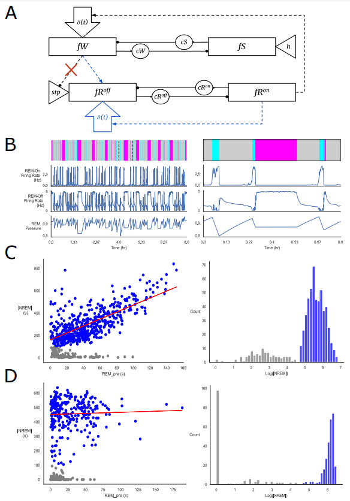
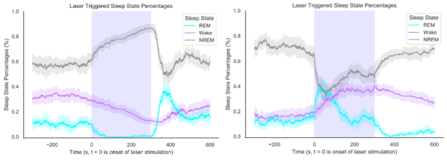

# Simulation of Dynamical Network Mechanisms Underlying Mouse Sleep (Work in Progress)
Modification of the mathematical model surrounding the sleep dynamics of mice described in "Coupled Flip-Flop Model for REM Sleep Regulation in the Rat" (Dunmyre, Mashor, and Booth 2014) by accounting for changes in sleep patterns due to optogenetic stimulation of a desired brain region. Code created with the help of Dr. Weber in the Weber Lab at the Perelman School of Medicine at the University of Pennsylvania.

Experimental and computational studies in rodent sleep have sought to understand the synaptic interactions underlying the neuronal regulation of rapid eye movement (REM) sleep. A recent computational model has demonstrated success in recreating rodent sleep state transitions via the coupling of two mutually inhibitory (MI) “flip-flop” models describing synaptic interactions between wake-promoting, non REM (NREM) sleep-promoting, REM sleep-promoting (REM-on), and REM sleep-inhibiting (REM-off) neuronal populations. While current experimental evidence favors models by which the alternation between NREM and REM sleep is governed by MI interactions, it is unclear whether these MI models can account for newly-identified features correlating the duration of a REM sleep period to its following NREM state duration. In this study, we present a modification to the dynamical network of this coupled flip-flop model to address these features.

# Figures
  
(A) Modified model architecture. The original Dunmyre model is shown in black. The red 'X' indicates the removal of a connection and the blue arrows indicate the addition of a connection. The REM-on dependent noise term excites the REM-off population to facillitate sequential REM transitions and a postive correlation between the duration of a REM-period and its subsequent NREM period duration. (B) A sample hypnogram of the modeled sleep states over an 8 hour period. Wake periods are violet, REM periods are blue, and NREM periods are gray. The REM-on, REM-off, and REM pressure values over this timecourse are shown with these sleep states. A zoom-in of the region between the 2 dashed black lines in the hypnogram is shown to the right. (C) Correlation between the duration of a REM period (REM_pre) and the duration of the subsequent NREM duraction (|NREM|) for our model. The |NREM| distribution is bimodal, where gray points are short, "sequential" transitions and blue points are longer, "single" transitions. Our model shows a positive correlation between the REM_pre duration and the |NREM| duration of "single" transitions. (D) As shown in (C), but for the original Dunmyre model. No such positive correlation between REM_pre and |NREM| is present.
 
   

Figure comparing model predictions of neuronal population firing rates to experimental data in progress.
 
 

  
Extension of our model to predict sleep states for rodents under the effect of optogenetic activation for specific neuronal populations. The figure shows the optogenetic activation of the REM-off population (left) and the REM-on population (right). Stimulation of the REM-off population forces transitions into NREM while reducing the presence of wake and REM states during the stimulation period. Following this, a large rebound in the REM state occurs. Stimulation of the REM-on population results in a transient increase to the amount of REM states present that does not last throughout the whole stimulation period.
 
   

Figure on network dynamics of sequential REM transitions in progress. 
